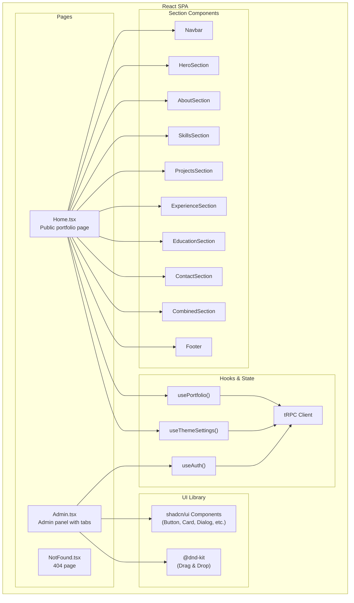
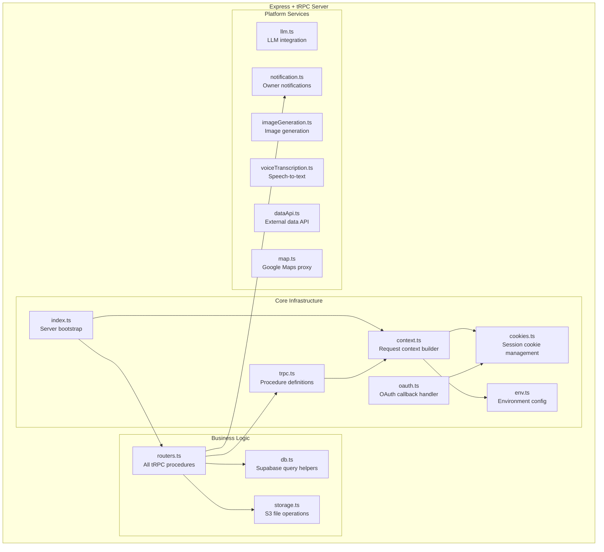

# C4 Component Diagram — Portfolio Template

## Frontend Components (SPA Container)

### Page Components

| Component | File | Responsibility |
|---|---|---|
| **Home** | `client/src/pages/Home.tsx` | Orchestrates the public portfolio. Fetches all data via `usePortfolio`, applies theme settings via `useThemeSettings`, and renders sections based on visibility config. Passes custom titles to each section. |
| **Admin** | `client/src/pages/Admin.tsx` | Protected admin panel with 6 tabs: Profile, Projects, Experience, Skills, Education, Layout. Each tab provides full CRUD, list/tile view toggle, drag-and-drop reorder with DragOverlay, and one-click duplicate. Uses `adminProcedure` for all mutations. |
| **NotFound** | `client/src/pages/NotFound.tsx` | Simple 404 page with navigation back to home. |

### Section Components

| Component | File | Props | Key Features |
|---|---|---|---|
| **Navbar** | `Navbar.tsx` | portfolio data | Scroll-spy active link, dark mode toggle (Moon/Sun), mobile hamburger menu, backdrop blur |
| **HeroSection** | `HeroSection.tsx` | profile, theme | Full-name display, tagline, subtitle, CTA buttons (pill-shaped), avatar image |
| **AboutSection** | `AboutSection.tsx` | profile, customTitle | Bio text, stat counters (years, projects, contributions), available-for-work badge |
| **SkillsSection** | `SkillsSection.tsx` | skillCategories, customTitle | Categorized skill grid with icons, warm card styling |
| **ProjectsSection** | `ProjectsSection.tsx` | projects, customTitle | Responsive grid (1→2→3 cols), image cards with tags, live/GitHub links, analytics tracking |
| **ExperienceSection** | `ExperienceSection.tsx` | experiences, customTitle | Timeline-style cards with role, company, period, description, tags |
| **EducationSection** | `EducationSection.tsx` | education, customTitle | Degree, institution, year, description cards |
| **ContactSection** | `ContactSection.tsx` | profile, customTitle | Contact form with email, social links, location info |
| **CombinedSection** | `CombinedSection.tsx` | skills + experience, customTitle | Combined view when both are visible, side-by-side layout |
| **Footer** | `Footer.tsx` | profile | Copyright, social links, scroll-to-top |

### Custom Hooks

| Hook | File | Returns | Purpose |
|---|---|---|---|
| **useAuth** | `_core/hooks/useAuth.ts` | `{ user, loading, isAuthenticated, logout }` | Authentication state from `trpc.auth.me` query |
| **usePortfolio** | `hooks/usePortfolio.ts` | `{ data, isLoading, error }` | Full portfolio data from `trpc.portfolio.getAll` |
| **useThemeSettings** | `hooks/useThemeSettings.ts` | `{ theme, isDark, toggleDarkMode }` | Theme settings + dark mode state with CSS variable injection |

---

## Backend Components (API Server Container)

### Core Infrastructure

| Component | File | Responsibility |
|---|---|---|
| **Server Bootstrap** | `server/_core/index.ts` | Creates Express app, mounts tRPC middleware at `/api/trpc`, registers OAuth callback, serves Vite in dev / static files in production |
| **Request Context** | `server/_core/context.ts` | Builds tRPC context for each request — extracts JWT from session cookie, resolves user from MySQL, attaches `ctx.user` |
| **Procedure Definitions** | `server/_core/trpc.ts` | Defines `publicProcedure`, `protectedProcedure`, `adminProcedure` with auth guards |
| **OAuth Handler** | `server/_core/oauth.ts` | Handles `/api/oauth/callback` — exchanges code for token, creates/updates user in MySQL, sets JWT cookie |
| **Cookie Management** | `server/_core/cookies.ts` | Configures session cookie options (httpOnly, secure, sameSite) based on environment |
| **Environment Config** | `server/_core/env.ts` | Centralizes all environment variable access with validation |

### Business Logic

| Component | File | Responsibility |
|---|---|---|
| **Routers** | `server/routers.ts` | All tRPC procedures organized by namespace. Handles input validation (Zod), authorization checks, and calls to db helpers. Covers CRUD, reorder, bulk tag update, and theme management across all content types. |
| **Database Helpers** | `server/db.ts` | Supabase query functions for all content types. Dual-client pattern: anon key for public reads (RLS), service role for admin writes. Covers profile, projects, experiences, skills, education, theme, analytics, reorder, and bulk operations. |
| **Storage** | `server/storage.ts` | S3 upload (`storagePut`) and presigned URL generation (`storageGet`). Handles project images, avatars, and resume PDFs. |

### Platform Services

| Component | File | Responsibility |
|---|---|---|
| **LLM** | `server/_core/llm.ts` | `invokeLLM()` helper for chat completions via Forge API |
| **Image Generation** | `server/_core/imageGeneration.ts` | `generateImage()` helper for AI image creation |
| **Notifications** | `server/_core/notification.ts` | `notifyOwner()` for sending alerts to portfolio owner |
| **Voice** | `server/_core/voiceTranscription.ts` | `transcribeAudio()` for speech-to-text |
| **Data API** | `server/_core/dataApi.ts` | External data fetching via Forge API hub |
| **Maps** | `server/_core/map.ts` | Google Maps API proxy with auto-authentication |

---

## Shared Components

| Component | File | Responsibility |
|---|---|---|
| **Types** | `shared/types.ts` | Shared TypeScript interfaces between client and server |
| **Constants** | `shared/const.ts` | Shared constants (error messages, timeouts) |
| **Errors** | `shared/_core/errors.ts` | Standardized error definitions |

---

## Database Schema Components

| Component | File | Responsibility |
|---|---|---|
| **Drizzle Schema** | `drizzle/schema.ts` | MySQL table definitions for `users` table (auth) |
| **Drizzle Relations** | `drizzle/relations.ts` | Table relationship definitions |
| **Migrations** | `drizzle/migrations/` | Generated SQL migration files |
| **Supabase Tables** | (managed via Supabase dashboard) | PostgreSQL tables for all portfolio content |
