# C4 Container Diagram — Portfolio Template

## Container Diagram

```mermaid
graph TB
    subgraph "Portfolio Template"
        spa["🖥️ Single Page Application<br/>(React 19 + Tailwind 4)<br/>Serves public portfolio & admin panel"]
        api["⚙️ API Server<br/>(Express 4 + tRPC 11)<br/>Handles all business logic"]
        vite["🔧 Vite Dev Server<br/>(Development only)<br/>HMR + proxy to API"]
    end
    
    subgraph "External Systems"
        supabase["☁️ Supabase<br/>(PostgreSQL)<br/>Portfolio content"]
        mysql["☁️ MySQL/TiDB<br/>(Drizzle ORM)<br/>Auth & sessions"]
        s3["☁️ AWS S3<br/>File storage"]
        oauth["☁️ Manus OAuth<br/>Authentication"]
        forge["☁️ Manus Forge<br/>Platform APIs"]
    end
    
    spa -->|"tRPC over HTTP<br/>/api/trpc/*"| api
    api -->|"Supabase JS Client<br/>(anon key for reads,<br/>service role for writes)"| supabase
    api -->|"Drizzle ORM<br/>(mysql2 driver)"| mysql
    api -->|"AWS SDK v3<br/>(PutObject, GetObject)"| s3
    api -->|"OAuth 2.0 flow<br/>(/api/oauth/callback)"| oauth
    api -->|"REST API<br/>(Bearer token)"| forge
    vite -.->|"Proxy /api/*"| api
```

## Containers

### 1. Single Page Application (SPA)

| Property | Value |
|---|---|
| Technology | React 19, Tailwind CSS 4, shadcn/ui, wouter |
| Deployment | Static files served by Express in production; Vite dev server in development |
| Entry Point | `client/src/main.tsx` |
| Routing | Client-side via wouter (`/`, `/admin`, `/404`) |

**Responsibilities:**
- Render the public portfolio homepage with all sections
- Render the admin panel with tabbed content management
- Manage client-side state (theme, auth, portfolio data)
- Communicate with API server exclusively via tRPC hooks

**Key Pages:**

| Route | Component | Access | Purpose |
|---|---|---|---|
| `/` | `Home.tsx` | Public | Portfolio homepage with all sections |
| `/admin` | `Admin.tsx` | Admin only | Content management panel |
| `/404` | `NotFound.tsx` | Public | 404 error page |

### 2. API Server

| Property | Value |
|---|---|
| Technology | Express 4, tRPC 11, Zod 4, jose (JWT) |
| Entry Point | `server/_core/index.ts` |
| API Surface | `/api/trpc/*` (all procedures), `/api/oauth/callback` (auth) |
| Port | Dynamic (not hardcoded) |

**Responsibilities:**
- Handle all tRPC procedure calls (CRUD for all content types)
- Manage authentication via JWT session cookies
- Enforce authorization (public vs. protected vs. admin procedures)
- Validate all inputs with Zod schemas
- Proxy file uploads to S3
- Send owner notifications via Forge API

**Procedure Namespaces:**

| Namespace | Access | Procedures |
|---|---|---|
| `auth` | Public | `me`, `logout` |
| `portfolio` | Public | `getAll` (full portfolio data) |
| `theme` | Public | `get` (theme settings) |
| `analytics` | Public | `trackEvent` |
| `adminProfile` | Admin | `get`, `update` |
| `adminProjects` | Admin | `list`, `get`, `create`, `update`, `delete`, `reorder`, `bulkTileSize`, `bulkTags`, `uploadImage` |
| `adminExperiences` | Admin | `list`, `get`, `create`, `update`, `delete` |
| `adminSkills` | Admin | `list`, `get`, `create`, `update`, `delete` |
| `adminEducation` | Admin | `list`, `get`, `create`, `update`, `delete` |
| `adminTheme` | Admin | `get`, `update`, `reset` |
| `adminAnalytics` | Admin | `summary`, `detail` |

### 3. Supabase (PostgreSQL)

| Property | Value |
|---|---|
| Client | `@supabase/supabase-js` v2.95.3 |
| Access Pattern | Anon key (public reads with RLS) + Service role key (admin writes) |

**Tables:**

| Table | Purpose | Key Columns |
|---|---|---|
| `profiles` | Portfolio owner info | full_name, title, bio, hero_tagline, social URLs |
| `projects` | Project showcase entries | title, description, image_url, tags, featured, sort_order |
| `experiences` | Work history | role, company, period, description, tags |
| `skill_categories` | Grouped skills | title, icon, skills (JSON array) |
| `education` | Education entries | degree, institution, year, description |
| `theme_settings` | Visual customization | heading_font, body_font, accent_color, section_visibility, section_titles |
| `project_analytics` | Click tracking | project_id, event_type, referrer |

### 4. MySQL/TiDB (Auth Database)

| Property | Value |
|---|---|
| ORM | Drizzle ORM v0.44.5 with mysql2 driver |
| Migration | `drizzle-kit generate && drizzle-kit migrate` |

**Tables:**

| Table | Purpose | Key Columns |
|---|---|---|
| `users` | Authenticated users | openId, name, email, role (admin/user), loginMethod |

### 5. AWS S3 (File Storage)

| Property | Value |
|---|---|
| Client | `@aws-sdk/client-s3` v3.693.0 |
| Access | Server-side only via `storagePut()` and `storageGet()` |
| URL Pattern | Public CDN URLs returned after upload |

**File Types:**

| Type | Key Pattern | Example |
|---|---|---|
| Project images | `projects/{id}-{hash}.{ext}` | `projects/5-a3f9b2.png` |
| Avatar | `avatar/{hash}.{ext}` | `avatar/x7k2m.jpg` |
| Resume | `resume/{hash}.pdf` | `resume/r4n8p.pdf` |

## Communication Patterns

| From | To | Protocol | Data Format |
|---|---|---|---|
| SPA → API | HTTP | tRPC batched requests with Superjson |
| API → Supabase | HTTPS | Supabase JS client (PostgREST) |
| API → MySQL | TCP | mysql2 driver (Drizzle ORM queries) |
| API → S3 | HTTPS | AWS SDK v3 (PutObject/GetObject) |
| API → OAuth | HTTPS | OAuth 2.0 authorization code flow |
| API → Forge | HTTPS | REST API with Bearer token |
