# C4 System Context — Portfolio Template

## System Context Diagram

```mermaid
graph TB
    visitor["👤 Portfolio Visitor<br/>(Recruiter, Hiring Manager, Peer)"]
    owner["👤 Portfolio Owner<br/>(Software Engineer)"]
    
    portfolio["📦 Portfolio Template<br/>(Full-Stack Web Application)<br/>React + Express + tRPC"]
    
    supabase["☁️ Supabase<br/>(PostgreSQL Database)<br/>Content storage with RLS"]
    mysql["☁️ MySQL/TiDB<br/>(Auth Database)<br/>User sessions & roles"]
    s3["☁️ AWS S3<br/>(File Storage)<br/>Images, resumes, assets"]
    oauth["☁️ Manus OAuth<br/>(Authentication Provider)<br/>Admin login"]
    forge["☁️ Manus Forge API<br/>(Platform Services)<br/>LLM, notifications"]
    
    visitor -->|"Views portfolio,<br/>clicks projects,<br/>sends contact form"| portfolio
    owner -->|"Manages content via<br/>admin panel (/admin)"| portfolio
    
    portfolio -->|"Reads/writes<br/>portfolio content"| supabase
    portfolio -->|"Manages user<br/>sessions & auth"| mysql
    portfolio -->|"Stores/retrieves<br/>files"| s3
    portfolio -->|"Authenticates<br/>admin user"| oauth
    portfolio -->|"Sends owner<br/>notifications"| forge
```

## People

| Person | Role | Description |
|---|---|---|
| **Portfolio Visitor** | External User | Recruiters, hiring managers, peers, or anyone browsing the portfolio. They view the public homepage, browse projects, read about experience and skills, and may submit a contact form. No authentication required. |
| **Portfolio Owner** | Admin User | The software engineer who owns the portfolio. They log in via Manus OAuth, access the `/admin` route, and manage all content (profile, projects, experiences, skills, education, theme settings) through a tabbed admin panel. |

## Software Systems

| System | Type | Description |
|---|---|---|
| **Portfolio Template** | Internal | The main application — a full-stack web app serving a public portfolio homepage and a protected admin panel. Built with React 19 (frontend), Express 4 + tRPC 11 (backend), and dual databases. |
| **Supabase** | External | Managed PostgreSQL database hosting all portfolio content: profile information, projects, experiences, skills, education entries, theme settings, and project analytics. Uses Row Level Security for public reads and service role for admin writes. |
| **MySQL/TiDB** | External | Managed MySQL database for user authentication. Stores user records with roles (`admin`/`user`), session data, and login timestamps. Managed via Drizzle ORM with migrations. |
| **AWS S3** | External | Object storage for all uploaded files — project screenshots, avatar images, resume PDFs. Files are uploaded via server-side `storagePut()` and served via public CDN URLs. |
| **Manus OAuth** | External | OAuth 2.0 authentication provider. Handles the admin login flow — the portfolio owner authenticates via Manus, and the callback creates a JWT session cookie. |
| **Manus Forge API** | External | Platform services API providing LLM capabilities, image generation, voice transcription, and owner notifications. Used for the contact form notification system. |

## User Journeys

### Visitor Journey

1. Visitor lands on the homepage (`/`)
2. Sees hero section with name, tagline, and CTA buttons
3. Scrolls through sections: About, Experience, Skills, Education, Projects, Contact
4. Each section animates in on scroll (fade-in + slide-up)
5. Can toggle dark mode via navbar icon
6. Can click project cards to visit live demos or GitHub repos
7. Can submit the contact form (triggers owner notification)
8. Can download the resume PDF

### Owner (Admin) Journey

1. Owner navigates to `/admin`
2. Redirected to Manus OAuth login if not authenticated
3. After login, sees tabbed admin panel with sections:
   - **Profile**: Edit name, title, bio, social links, avatar, resume
   - **Projects**: CRUD projects with drag-and-drop reorder, image upload, bulk tag update
   - **Experience**: CRUD work history entries with reorder
   - **Skills**: CRUD skill categories with icon picker and reorder
   - **Education**: CRUD education entries
   - **Layout**: Theme customization (fonts, accent color, section visibility, section titles)
4. All changes take effect immediately on the public homepage
5. Can track project link clicks via analytics
